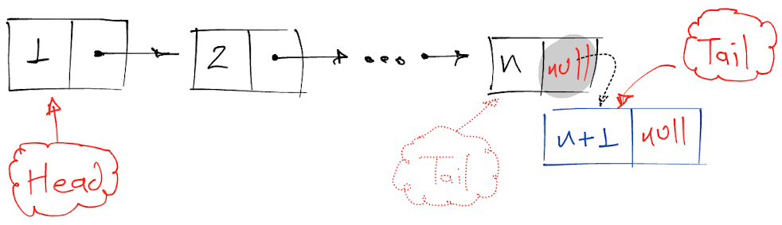
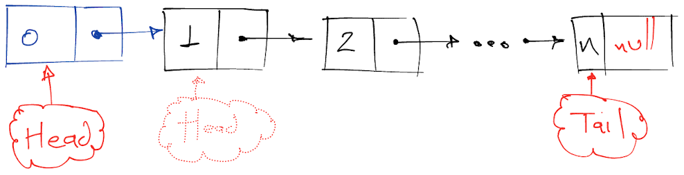
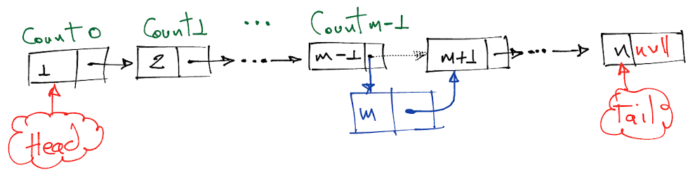
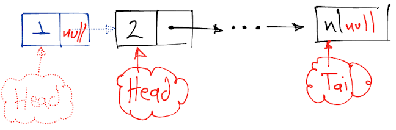
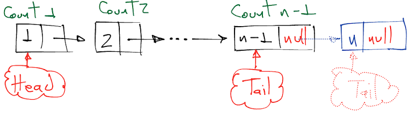

# Singly Linked List
Linked lists are linear dynamic data structures able to manage memory at runtime. On the surface, it might look like both arrays and linked lists are the same, but underneath, their behavior makes them different.

Elements in a linked list can point to the next element, rather than letting the data structure pointing to a specific physical memory location. These elements are widely known as Linked List Nodes or simply Nodes.

Nodes represent not only a value, but a reference to the next node (i.e. next node's memory address). This extra reference is known as a Link.


## Operations
Consider having a linked list initialized as
```js
const linkedList = new LinkedList();
```

The available operations are as follows.

### `linkedList.length`
This operation has `O(1)` runtime since keeping the internal `size` variable updated is the key at insertion and deletion.

```js
1 length() {
2   return this.size;
3 }
```

### Insertion
This implementation considers three cases: **Append**, **Prepend**, and **Insert** at a given position.

#### `linkedList.append`
**Append** adds a node at the end of the linked list. The new appended node must be the linked list's tail and it must point to null, since it's the last one. The previous tail points to the new tail. This operation is `O(1)` runtime because there is no need to traverse the whole linked list, it's just a matter of using current tail and replace such reference.



```js
1  append(value) {
2    // Let's create the isolated node.
3    const node = new LinkedListNode(value);
4
5    // We increase this linked list length.
6    this.size++;
7
8    // The new node is the head and tail if this linked list is empty.
9    if (!this.head) {
10     this.head = node;
11     this.tail = node;
12
13     return this;
14   }
15
16   // Attach the new node to the end of the linked list
17   this.tail.next = node;
18   this.tail = node;
19
20   return this;
21 }
```

#### `linkedList.prepend`
**Prepend** adds a node at the beginning of the linked list. The new prepended node must be linked to the list's head and it must point to the previous head. There is no need to do further manipulation on the previous head since it already points to the next node. This operation is `O(1)` runtime because the node to manipulate is easily located through the linked list's head pointer.



```js
1  prepend(value) {
2    // The new node has to be the head of this list no matter what
3    const node = new LinkedListNode(value, this.head);
4    this.head = node;
5
6    // If there is no tail yet, we must have to create it
7    if (!this.tail) {
8      this.tail = node;
9    }
10
11   this.size++;
12
13   return this;
14 }
```

#### `linkedList.insert`
**Insert** adds a node at a given position in the linked list. The new inserted node must be placed between nodes that are already linked in the list. This operation is however more complex than append or prepend since in this case we need to traverse the linked list up to the point where the insertion must be done. Thus, insertion is `O(n)` runtime complex.



```js
1  insert(value, rawIndex) {
2    // We must guarantee the index is in the boundaries
3    const index = rawIndex < 0 ? 0 : rawIndex;
4  
5    // If the index is 0, this is a prepend.
6    if (index === 0) this.prepend(value);
7    else {
8      this.size++;
9      let count = 1;
10     let currentNode = this.head;
11 
12     // We create the node
13     const node = new LinkedListNode(value);
14 
15     // We have to traverse the linked list up to the point of insertion
16     while (currentNode) {
17       if (count === index) break;
18       currentNode = currentNode.next;
19       count++;
20     }
21 
22     // We perform the insertion on the reached node.
23     if (currentNode) {
24       node.next = currentNode.next;
25       currentNode.next = node;
26     }
27     else {
28       // We perform the insertion at the end.
29       if (this.tail) {
30         this.tail.next = node;
31         this.tail = node;
32       }
33       else {
34         this.head = node;
35         this.tail = node;
36       }
37     }
38   }
39 
40   return this;
41 }
```

### Deletion
Let's consider this implementation options: **Delete at Head**, **Delete at Tail**, **Delete All Nodes With Certain Value**, **Delete a Single Node With Certain Value**. For all this option, the deleted node is returned to the user. For instance, deleting the head could be used as follows.

```js
// We create the linked list.
const linkedList = new LinkedList();
// We append some values.
// 1 -> 2 -> 3 -> null
linkedList
  .append(1)
  .append(2)
  .append(3);

// We delete the node. `deletedNode` is now a `LinkedListNode` with value set to 1.
// Our linked list was left like this
// 2 -> 3 -> null
const deletedNode = linkedList.deleteHead();
```

#### `linkedList.deleteHead`
By deleting the head, the user will get the node that was in the head. The linked list will have the linked list's head pointing to the previous head's next node, making it the new head, so the previous head is dettached from the list. The next's previous node is set to null. Since we can access the head immediately this operation is `O(1)` runtime complex.



```js
1  deleteHead() {
2    // We return null for an empty linked list.
3    if (!this.head) return null;
4
5    // We create the dettached node.
6    let deletedNode = this.head;
7
8    // If the linked list has only one element, we must update the tail reference as well.
9    if (this.head === this.tail) this.tail = null;
10
11   // We move the linked list head to the deleted head's next node.
12   this.head = deletedNode.next;
13
14   // We decrease this linked list length.
15   this.size--;
16
17   // We return the dettached node.
18   return deletedNode;
19 }
```

#### `linkedList.deleteTail`
By deleting the tail, the user will get the node that was in the tail. The linked list will have the linked list's tail dettached. However, the tail's previous node cannot be easily tracked (this is discussed on doubly linked lists topic), thus, forcing us to traverse to the `n-1th` node. Once there, we make the `n-1th` node the new tail, pointing its next node to `null`. This situation makes this operation `O(n)` runtime complex.



```js
1  deleteTail() {
2    // If the linked list is empty we return null.
3    if (!this.head) return null;
4 
5    let deletedNode = null;
6 
7    // We delete the head if this linked list has only one node.
8    if (!this.head.next) {
9      deletedNode = this.head;
10     this.head = null;
11     this.tail = null;
12     return deletedNode;
13   }
14
15   // We traverse up to the n-1th node
16   let currentNode = this.head;
17   while (currentNode.next.next) {
18     currentNode = currentNode.next;
19   }
10
20   // We set the deleted node, not to the tail, but the n-1th node's next node.
21   deletedNode = currentNode.next;
22
23   // We dettach the tail out of the n-1th node.
24   currentNode.next = null;
25
26   // We update this linked list's tail reference.
27   this.tail = currentNode;
28
29   // We decrease this linked list length.
30   this.size--;
31
32   return deletedNode;
33 }
```

## Runtime Complexity Overview
| Access | Search | Insertion                  | Deletion                   |
|:------:|:------:|:--------------------------:|:--------------------------:|
| `O(n)` | `O(n)` | `O(n)` `O(1)` at beginning | `O(n)` `O(1)` at beginning |`

## Space Complexity
Linked lists have `O(n)` space complexity.