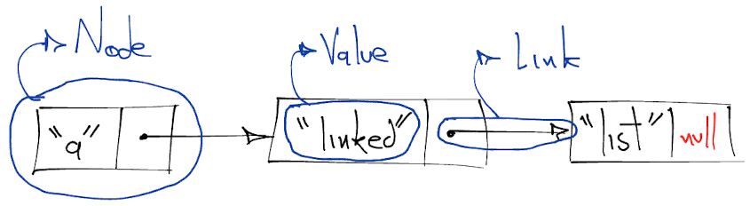

# Singly Linked List
Linked lists are linear dynamic data structures able to manage memory at runtime. On the surface, it might look like both arrays and linked lists are the same, but underneath, their behavior makes them different.

Elements in a linked list can point to the next element, rather than letting the data structure pointing to a specific physical memory location. These elements are widely known as Linked List Nodes or simply Nodes.

Nodes represent not only a value, but a reference to the next node (i.e. next node's memory address). This extra reference is known as a Link.



## Operations
Consider having a linked list initialized as
```js
const linkedList = new LinkedList();
```

The available operations are as follows.

### `linkedList.length`
This operation has `O(1)` runtime since keeping the internal `size` variable updated is the key at insertion and deletion.

### `linkedList.append`

## Runtime Complexity
| Access | Search | Insertion                  | Deletion                   |
|:------:|:------:|:--------------------------:|:--------------------------:|
| `O(n)` | `O(n)` | `O(n)` `O(1)` at beginning | `O(n)` `O(1)` at beginning |`

## Space Complexity
Linked lists have `O(n)` space complexity.